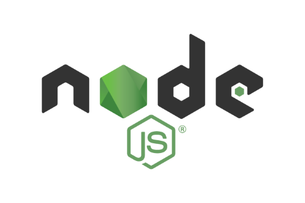

[](https://github.com/DanneDevOoops/webApp_v4/actions/workflows/lint_and_check_actions.yml)
[](https://github.com/DanneDevOoops/webApp_v4/actions/workflows/jest_test_runner.yml)
[](https://dannedevooops.github.io/webApp_v4/)


# WebApp v4

Course repo for studies in webApp version 4 at BTH spring of 2022. We are going to create a 
React Native mobile application using Expo and other related stuff. The course will create
a warehouse application where basic things like API requests, forms, login, error handeling, etc.
is learned. Once the pratice parts are done a examination project takes place and we get to
follow a made up project by the teachers or a self made project. There are certain criterias to fill
for the project but relativly free hands are given if so wished.

## Project Prerequisites

- Installed `node.js` version `20.19.0`
- Package management tool `yarn`, you can use other tools like `npm` or `bun` but `yarn` is 
  recommended since I used it to build this project.
- Expo Go app installed on your mobile device.
- Expo-CLI installed on your machine.

### Guidance on installing the prerequisites

[//]: # ( ---------- NV & NODE JS INSTALLATION ---------- START ---------- )
<details><summary style="font-size: 14px; font-weight: bold; color: lightgreen;"> Install Node 
Version Manager and 
Node.js</summary>

  

# Install and use Node Version Manager and Node.JS

Node Version Manager (`NVM`) is a great tool under [MIT licence](https://en.wikipedia.org/wiki/MIT_License) 
for easy install and management of Node.js versions. Due to the fact that the version of Node.
js you may need for a project is not the latest or nor the same as another project, you may want 
to use NVM to install and manage versions of Node.js to overcome some cumbersome manual steps 
you would need to do without it.

## Prerequisites
- You need a terminal (CLI)

## Step 1: Install NVM
There are different ways to install NVM. It can be installed in a 
containerized environment or directly on your local machine. Choose your preferred method from the
[official NVM repository](https://github.com/nvm-sh/nvm?tab=readme-ov-file#about) and install it 
accordingly.



## Step 2: Install & Verify a LTS version of Node.js
Once `NVM` is installed you can install one or more versions of Node.js. Read the usage section 
in the [official NVM repository](https://github.com/nvm-sh/nvm?tab=readme-ov-file#usage) 
to learn how to install a specific version of Node.js.

In short these are the steps to install a new version of node.js:

First check for the LTS versions available to install from remote. We want a `long term support` 
(LTS) version because it is more stable and has a longer support period then other versions of 
`Node.js`.

```sh
nvm ls-remote --lts
```

If you need to know the latest version of each LTS release, you can check the latest LTS release 
list in at the bottom of the output of the `nvm list` command. When you have one of the latest LTS 
releases installed, you can see the version number it in the list. For each of the latest LTS 
releases that have not been installed yet, they will be marked `(-> N/A)` for `not available`.

Now when you know which version you want to install you can run the following command to install it.
```sh
nvm install <node.js version>
```

After you have installed a version of Node.js that you like to use you can activate it by running 
the `nvm use` command in your terminal.

Check to see that the version you selected and installed is indeed installed on you system. The 
version you just installed should be listed among the version numbers in the list at the top 
before all the aliases and LTS releases.

```sh
nvm list
```

## Step 3: Activate the installed Node.js version
Now you can activate the version you want to use by running the `nvm use` command.

```sh
nvm use <node.js version>
```

To check that the version is activated you can use the `nvm current` command

```sh
nvm current
```

If you want to set the version you just activated as the default version to use, you can run the
following command.

```sh
nvm alias default <node.js version>
```

In case you work on sevral projects using different versions of Node.js, you can create a alias
for each version you use. This way you can easily switch between the versions you use for different
projects. 

Another way to manage the versions you use is to create a [`.nvmrc` file](https://github.com/nvm-sh/nvm?tab=readme-ov-file#nvmrc) 
in the root of your project. This file should contain the version number of the Node.js version 
you want to use for that project. When you navigate to the project folder in your terminal, NVM 
will automatically activate the version of Node.js you specified in the `.nvmrc` file. There is 
a caveat to this approach, your terminal needs to be POSTIX compliant.

To create a `.nvmrc` file you simply add the `--save` flag to the `nvm use` command when 
activating the version of Node.js you want to use for the project.

```sh
nvm use <node.js version> --save
```

#### Tip: Install latest version of NPM using NVM
If you want to install the latest version of NPM you can run the following command.

```sh
nvm install-latest-npm
```

Node version manager is capable of many nice features when it comes to Node.js and its 
surrounding ecosystem. As an example it is also able to upgrade the version of NPM you have 
installed globally. Be sure to checkout the `help command` for more information on how to use the 
`nvm` command or simply [RTFM](https://github.com/nvm-sh/nvm?tab=readme-ov-file#nvmrc).

```sh
nvm help
```

```
Done installing Node Version Manager, Node.js and activating your Node.js environment
```

</details>

[//]: # ( ---------- NV & NODE JS INSTALLATION ---------- END ---------- )

[//]: # ( ---------- EXPO GO INSTALLATION ---------- START ---------- )
<details><summary style="font-size: 14px; font-weight: bold; color: lightgreen;"> Install Expo 
Go app on you 
mobile device</summary>


## Install Expo Go on your device
Here you can follow a step by step guide on how to install Expo Go on your device. Expo Go is a
mobile app that allows you to run and test your Expo applications on your own device. This is
a great way to test your application on a real device and see how it behaves in a real world
scenario.

### Prerequisites on installing Expo Go
To install Expo Go on your device you need the following:
- A Android and/or iOS device (not too old) to install the app on
- A network or mobile connection to the internet
- App Store or Google Play account for downloading the app

### Step 1 - Go to the Expo install page and download Expo Go
Lucky for us, Expo Go have a beautiful and easy site to install the app from. Just go to the 
[Expo install page](https://docs.expo.dev/get-started/set-up-your-environment/?mode=expo-go&platform=android&device=physical) 
and follow the instructions, you make a few choices depending on what device you  have and you 
get a QR code to scan with your phone. Viola! You have the app installed and ready in no time.

Following the instructions on the page you will be redirected to eather 
[App Store](https://apps.apple.com/us/app/expo-go/id982107779) or
[Google Play](https://play.google.com/store/apps/details?id=host.exp.exponent&referrer=docs&pli=1)
to download the app.

### Step 2 - Connect to a network
When you have the app installed you can open different apps within it by scanning a QR codes 
from each represented application repo. This is done by opening the Expo Go app and scanning the
QR code from the terminal or browser. It is important to know that if you run the app as a server
your device must be connected to the same network as the server for the app to connect to the 
same development application. Make sure your device is connected to the same network as your
development server, if you intend to run it this way.

### Step 3 - Create an Expo account
Preferably you also you want to create your own account on Expo, this is necessary to be able to 
work on the application in the future. You can create an account by going to the
[Expo sign up page](https://expo.dev/signup) and follow the instructions.


```
Done installing Expo Go on your mobile device!
```
</details>

[//]: # ( ---------- EXPO GO INSTALLATION ---------- END ---------- )


## Check out the application

There are different ways to access this application. You can either open the application directly
with the Expo Go app or you can spin up a local development server and open the application in the
Expo Go app or in a simulation on your machine. Below you will find instructions on how to do both.

<details><summary style="font-size: 14px; font-weight: bold; color: lightskyblue;"> Alt. 1 - 
Open directly with Expo Go</summary>

### Open project with Expo Go app
Since `Expo` was used to develop this application we can easily open the project with the `Expo 
Go app`. Open [the application link](https://expo.dev/preview/update?message=fix%20lint%20issues%20and%20types%0A%0ATook%206%20minutes&updateRuntimeVersion=1.0.0&createdAt=2025-03-11T22%3A13%3A17.014Z&slug=exp&projectId=bc99ef28-9b0c-44f4-810a-a36e5c12b0c7&group=f3e97dc5-7565-4a9e-a869-46aae0d5f9c2) 
and scan the QR code from your mobile device and you will be linked to open the project in the 
Expo Go app.

```
Hope you enjoy the application!
```
</details>


<details><summary style="font-size: 14px; font-weight: bold; color: lightskyblue;"> Alt. 2 - 
Spin up a local dev server and open in Expo Go and/or simulation</summary>

This is an alternative way to open the application in the Expo Go app. This way you can run the

### Step 1 - Clone the GitHub repository

#### 1.1 Place yourself in the directory where you want to clone the repo
Navigate to the directory where you want to clone the repository in your local CLI.

#### 1.2 Clone the repository
```sh
git clone https://github.com/DanneDevOoops/webApp_v4.git
```

#### 1.3 Navigate to the project root folder
```sh
cd webApp_v4
```

### Step 2 - Install project dependencies

Now that you have cloned the repository you need to install the project dependencies. You can do
this step using any node.js package manager, like `npm`, `yarn` or `bun`. We will focus on using 
`yarn` since it was used to develop this project. If you for any reason prefer to use `npm` or
`bun` you can easily replace `yarn` with the package manager of your choice in the following
commands but first you should remove the `yarn.lock` file since the lock file is specific to 
`yarn`.

Now install the project dependencies by running the following command from the project root folder.

```sh
yarn install
```

If you intend to do any work on the project or run some of the scripts in the `package.json` file
you should also install the development dependencies. You can do this by running the following
yarn command.

```sh
yarn install --dev
```

### Step 3 - Start the application server

Now that you have installed the project dependencies you can start the application server. You can
do this by running one of the following commands depending on the type of device you intend to 
run the application. Make sure you are placed in the project root folder first.

#### 3.1 - Connect both devices to the same network
When we run the Expo Go app in connection to a local dev server we need to make sure that the
device running the server and the device running the Expo Go app are connected to the same network.
This is necessary for the devices to be able to communicate with each other.


#### 3.2.1 - Start the application server

First you start the application server locally by running the following command from the project 
root folder. When the server is running you will be presented by a QR code and some options in 
your CLI. From here you can access the application from on you device by scanning the QR code 
and the project link will be presented to open it inside your Expo Go app.

```sh
yarn start
```

#### 3.2.2 - Start the application server and simulate for Android devices
Either you directly run the general start command below or you run the generat `yarn start` command 
and then choose the option to run the application on an Android device. When the application 
server is running the choice for `Android simulation` is `a` or `shift + a` if you like to select 
what device to simulate on. The choice for `iOS simulation` is `i` or `shift + i` to select what
iOS device.

If you rather start the application server and `simulate` an `Android` or `iOS` device directly 
you can run the direct executing commands below.

You will be able to start any of the device simulations installed on your machine.

```sh
yarn android
```

#### 3.2.2 - Start the application server for iOS device
```sh
yarn ios
```

#### 3.2.3 - Start the application server for web
```sh
yarn web
```

```
Hope you enjoy the application!
```
</details>


## Wanna work further on this project?

To move forward on this project there are some things you might want to know about regarding 
the standard, tooling and what have been done at a prior stage to make it what it currently is.

Make sure to check out the projects [development documentation](https://dannedevooops.github.io/webApp_v4/)
for references and description on the code base.

<details><summary style="font-size: 16px; font-weight: bold; color: lightgoldenrodyellow;">Project 
standards, tooling and workflows / actions</summary>

### Node.js version disclaimer
For this project we are using `Node.js` version `20.19.0`. Its been defined in the `tsconfig.json` 
file as `target: ES2020` and this is important to keep in mind when you are working on the 
project. In case of stepping out of this version you may experience some issues with the 
packages configured to work for you in the process of development. As and example `TypeDoc` 
compatability will not react outside of the `ES2020` version of `Node.js` and there might as 
well be sevral others currently unknown to me. That beeing said, it might still be possible to 
spin up a development server for temporarily viewing the application on a different version of `Node.
js`.


### Linting, formatting and type checking the code base
If you intend to do any keep working on this project there are a few things you should know for 
the best possible experience moving forward. The project have a few scripts in the `package.
json` so this would be you absolut starting point to pick things up. 

You should keep a good pace of linting the code base moving forward and for this purpous `eslint` 
and `prettier` have been configured to keep things cleaner, semantically a little bit more correct 
and somewhat more cohesive in terms of readable chunk of code. To know more on the linting and
other checks you should have a look at the configuration in the file `eslint.config.mjs` at 
project root level. Its been setup fairly standard but could potentially be tighten up a bit
depending on your preferences for such things.

To execute the linting and formatting checks you can run the following command from the project 
root folder.

```sh
yarn lint
```

As TypeScript was chosen as the language for this project you should also keep a good pace of
type checking the code base. We also run a this check to make sure the code is able to compile 
from TypeScript to JavaScript, which is where it will be at runtime and after the 
development/production build process completes. This check can be executed by running the following 
command from the project root folder.

```sh
yarn ts:check
```


### Testing the code base
Besides the standard of linting, formatting and type-/compile checking your codebase you should 
also keep writing `tests` for your code. This is a good practice to keep the codebase stable and 
to make sure that the code you write is working as intended. This will help in moving forward from 
development into a production environment with more confidence.

The project have been configured with `Jest` as the testing library. Jest is a great testing
library that is easy to use and have a lot of features that can help you write good tests for your
code. If you are familiar with other JS testing libraries like `Mocha` or `Jasmine` you will feel
right at home with `Jest` as the anatomy of the tests are quite similar.

To execute the test runner `jest`, a script have been a configured in the `package.json` 
file. Execute it with the following command from the project root folder.

```sh
yarn test
```

### Development documentation
To keep the project documentation up to date and to make sure that the code is well documented
you should keep writing docstrings for each part of the code base as you go along. This will help
you and others to understand the code better and to keep track of what each part of the code 
does as it grows in size and complexity. To suit this purpose we have configured `TypeDoc` to
generate documentation from the codebase docstrings. The documentation is automatically generated 
from the docstrings in when pushing to the `main branch` of the repository. You will find the 
generated documentation in the `docs` folder under `html`.


### CI/CD pipelines wiht GitHub Actions
As you know, nobody likes to do the same thing over and over again. This is where `CI/CD` 
pipelines make a great entry. To avoid generating the development documentation manually, update 
linting-, formatting-, type checking- and testing badges manually and to keep the project 
updated enough for anyone else to pick it up and continue we use `Github Actions workflows`.

When you push to the `main branch` of the repository the `CI/CD` pipeline will be triggered and
run the following checks on the codebase:
- Linting and formatting checks
- Type checking and compiling checks
- Testing checks
- Documentation generation


### Checking React Native and Expo SDKs
It is still posible to have issues with the codebase even if the linting and type checking 
passes `correctly to 100%` and at time that can be a daunting thing to figure out. There is 
another command configured in the `package.json` file that potentially can help you a bit. This 
command is the `rn:doctor` that will run checks on the SDKs and other dependencies related to 
React Native and Expo. You can run this command from the project root folder. This may or may 
not be mor of a deployment check but it can be a good thing to run it from time to time to make sure
that the project is in a good state.

```sh
yarn rn:doctor
```

### As you go forward...
As you go forward with the project you should keep in mind that the project is a living thing and
that it will grow and change over time. To keep the project in a good state you should keep
writing tests, keep the codebase clean and well documented and keep the project up to date with
the latest versions of the dependencies. Remember Expo SDKs and React Native versions move fast 
as new mobile devices are released all the time, OS versions are updated on both iOS and Android.
What is todays truth might not be truth tomorrow but Ive made a effort set a basic standard here 
that allows for this project to be updated and maintained in a good way.

Good luck!

</details>


```
@author DanneDevOoops
```
